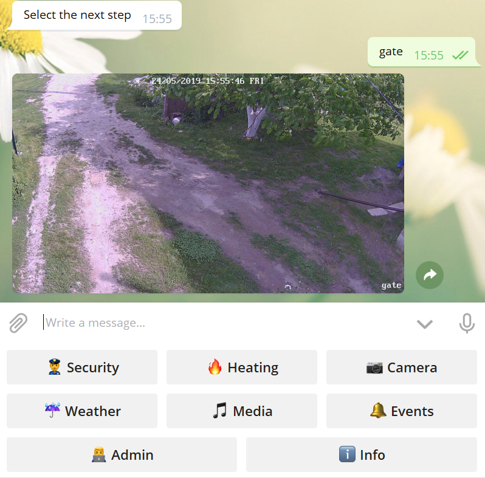

#  Smart Space
### Version is *2.0-SNAPSHOT* boot

SmartSpace is a Java Enterprise Web Application for manage your smart home or other IoT staff.


### Features:

* authorization and role based authentication
* zones (parts of controlled object) include triggers and cameras
* triggers generate events
* [Telegram Bot API](https://github.com/rubenlagus/TelegramBots) used for managing the system
* include [REST API](RestAPI.md) to communicate with client (Frontend)

### Telegram Bot API features

* take photo from camera
* show info from zones
* arming/disarming zones
* receiving notifications
* play radio
* say something



# Installation

### Install SQL DB

PostgerSQL is recommended.

### Install JRE

### Install VLC player

Use the same platform version (x64 or x86) for VLC and JRE

### Configure your properties - [application.properties](https://github.com/rublin/SmartSpace/resources/db/application.properties):

```
server.port=8088
spring.datasource.url=jdbc:postgresql://free.rublin.org:5432/smart
spring.datasource.username=smart_u
spring.datasource.password=DP...
spring.datasource.driver-class-name=org.postgresql.Driver
spring.datasource.platform=postgresql

# Windows tmp path
tmp.directory=C:\\tmp\\

# Linux tmp path
# tmp.directory=/tmp/
radio=http://192.99.147.61:8000

mail.password=Z...
mail.smtp=smtp.ukr.net
mail.from=sel...@ukr.net
mail.port=465
mail.login=sel...@ukr.net
mail.notification=true
telegram.bot.username=Smart Place Bot DEV
telegram.bot.token=25475...
telegram.bot=false
modem.port=COM3
modem.sms=false
modem.call_timeout=10000
weather.token=8d92...
weather.city=Kyiv
weather.lang=UA

sound.other=sound/other_alarm.wav
sound.security=sound/security_alarm.wav
sound.volume=80
```

### Build and run the application

```
java -Djna.library.path="C:\\Program Files\\VideoLAN\\VLC" -jar smartSpace.jar
```